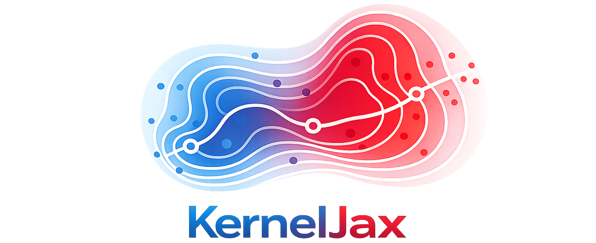

 

  <em>A low-level JAX interface for nonparametric kernel smoothing of mixed-type data.</em>

  <a href="https://kerneljax.readthedocs.io/en/latest/" target="_blank"><strong>Docs</strong></a> ·
  <a href="https://kerneljax.readthedocs.io/en/latest/api/index.html" target="_blank"><strong>API Reference</strong></a> ·
  <a href="https://kerneljax.readthedocs.io/en/latest/user_guide/index.html" target="_blank"><strong>Tutorials</strong></a> ·
  <a href="https://github.com/jordandeklerk/KernelJax/blob/main/CHANGELOG.md" target="_blank"><strong>Changelog</strong></a>

__KernelJAX__ is a low-level JAX library for nonparametric kernel smoothing of
mixed-type data, aimed at researchers who want to develop new methodology from
composable, differentiable building blocks. Each kernel, bandwidth selector, and
smoother is designed to be understood, modified, and recombined, not just
called. Through JAX and XLA, estimators built from these pieces run natively on
CPUs, GPUs, and TPUs with automatic differentiation and vectorized operations,
and fit naturally alongside the broader JAX ecosystem.

 

> [!WARNING]
> KernelJAX is in early development and has not been released yet. The API is
> unstable, and installation instructions, documentation, and examples are
> coming soon.
