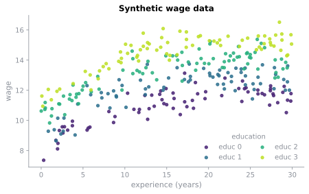
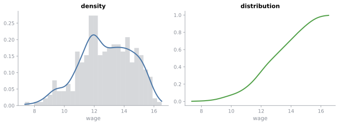
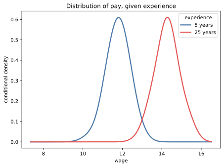

# Quickstart

KernelJax estimates smooth relationships without requiring you to choose a functional form in advance. This page walks through the main API on a small wage example with continuous, ordered, and unordered covariates.

We will fit a regression, inspect the bandwidths it learns, make predictions, estimate derivatives, and then use the same ideas for densities and conditional densities. Along the way, we will see how KernelJax handles mixed data types and how bandwidth selection determines what gets smoothed and by how much.

## The data

Suppose we want to understand how wages vary with experience while also accounting for education and region. We could specify a parametric model, perhaps a quadratic in experience with indicators for the categorical variables. Here we will instead let the shape of the relationship come from the data.

We use simulated data so that we know what the estimator should recover. Wage rises with experience before flattening and eventually declining slightly. Education shifts wages upward, while region is generated independently and carries no information about wage.

```python
import jax
import matplotlib.pyplot as plt
import numpy as np

import kerneljax as kj

rng = np.random.default_rng(0)
n = 300
exper = rng.uniform(0, 30, n)
educ = rng.integers(0, 4, n)
region = rng.integers(0, 4, n)
wage = 8 + 0.35 * exper - 0.008 * exper**2 + 1.2 * educ + rng.normal(0, 0.6, n)

data = kj.MixedData.from_blocks(
    continuous=exper,
    unordered=region,
    ordered=educ,
    unordered_levels=4,
    ordered_levels=4,
    names=("exper", "region", "educ"),
)

for name, kind in zip(data.spec.names, data.spec.kinds):
    print(f"{name:8s} {kind.value}")
```

```text
exper    continuous
region   unordered
educ     ordered
```

`MixedData` tells KernelJax how each covariate should be treated. Continuous variables are smoothed according to distance, ordered variables according to how far apart their levels are, and unordered variables according to whether their levels match.

Internally, columns are stored in block order. Continuous columns come first, then unordered, then ordered, and bandwidths follow the same layout.

```python
colors = ["#482475", "#2d708e", "#2ab07f", "#bddf26"]
fig, ax = plt.subplots()
for level, color in enumerate(colors):
    mask = educ == level
    ax.scatter(exper[mask], wage[mask], color=color, s=18, alpha=0.85, label=f"educ {level}")

ax.set_xlabel("experience (years)")
ax.set_ylabel("wage")
ax.set_title("Synthetic wage data")
ax.legend(title="education", loc="lower right", ncol=2)
plt.show()
```



The nonlinear relationship with experience is already visible, as are the shifts between education levels. We would like the estimator to recover both without specifying either pattern directly.

## Fit a regression

A local linear regression takes one line.

```python
fit = kj.local_poly(data, wage, "cv_ls", degree=1)
print(kj.summary(fit))
```

```text
Local polynomial regression

  Observations                         300
  Continuous variables                   1
  Unordered variables                    1
  Ordered variables                      1
  Estimator                   local linear
  Bandwidth type                    shared

  Variable      Kind             Bandwidth
  exper         continuous        2.792168
  region        unordered         0.750000
  educ          ordered           0.036096

  Continuous kernel         Gaussian, order 2

  Residual standard error         0.537311
  R-squared                       0.908361

  Selection                          cv_ls
  Criterion value                 0.334907
  Solver iterations                     27
  Converged                           True
```

There are two important choices in that call.

`degree=1` asks for a local linear fit. Instead of fitting one global line to the entire sample, KernelJax fits a small weighted line around each point where the regression function is evaluated.

`"cv_ls"` tells KernelJax to choose the bandwidths by least-squares cross validation. Each observation is left out in turn, and the selected bandwidths are the ones that predict those held-out observations best.

Formally, observations receive weights

$$
K_{h,\lambda}(x, X_i) = \prod_d K_d(x_d, X_{id}),
$$

where each covariate contributes a kernel appropriate to its data type. The local polynomial is then obtained from

$$
\hat\beta(x) = \arg\min_{\beta} \sum_{i=1}^{n} K_{h,\lambda}(x, X_i) \bigl(Y_i - \beta^\top b(X_i-x)\bigr)^2.
$$

The intercept gives the estimated conditional mean,

$$
\hat m(x) = e_1^\top\hat\beta(x),
$$

while the remaining coefficients provide derivatives with respect to the continuous covariates.

The bandwidths are selected by minimizing

$$
(\hat h,\hat\lambda) = \arg\min_{h,\lambda} \frac{1}{n} \sum_{i=1}^{n} \bigl(Y_i-\hat m_{-i}(X_i)\bigr)^2.
$$

You do not need these equations to use the API, but they provide the useful mental model. KernelJax decides how local each fit should be, then estimates the relationship using nearby observations.

## What the bandwidths tell us

The fitted bandwidths are worth looking at closely.

```text
Variable      Kind             Bandwidth
exper         continuous        2.792168
region        unordered         0.750000
educ          ordered           0.036096
```

For a continuous variable such as experience, the bandwidth controls the width of the local neighborhood. Larger values pool observations over a wider range, and smaller values make the fit more local.

Categorical bandwidths have a slightly different interpretation. At one extreme, observations from different categories receive little or no weight. At the other, category membership stops affecting the weights at all.

For the default Aitchison-Aitken kernel used with unordered variables, that upper bound is $(c-1)/c$ when there are $c$ levels, so four regions put it at $3/4$.

```python
bound = kj.AitchisonAitken().upper_bound(4)
print(f"region  lam={fit.bandwidth.lam_uno[0]:.6f}  bound={bound:.6f}")
print(f"educ    lam={fit.bandwidth.lam_ord[0]:.6f}")
```

```text
region  lam=0.750000  bound=0.750000
educ    lam=0.036096
```

Region lands exactly on its upper bound. At that value, every region receives the same weight, so region has effectively been smoothed out of the regression.

Education behaves very differently. Its bandwidth is close to zero, so observations at different education levels are kept relatively distinct.

That is exactly what we hoped to recover from the simulated data. Region was generated independently of wage, while education has a real effect. We did not need a separate significance test or variable-selection step to produce this behavior. It emerged from choosing the bandwidths that best predicted held-out observations.

This ability to smooth across uninformative variables is especially useful in nonparametric models, where unnecessary dimensions can otherwise make estimation much harder. [Bandwidth selection](background/selection.md#what-cross-validation-buys) develops that idea in more detail.

## Make predictions

Next, let us look at the fitted relationship with experience.

Because the model contains three covariates, we cannot draw the entire fitted surface directly. Instead, we vary experience while holding region and education at representative values.

`grid` does this for us.

```python
points = kj.grid(data, vary="exper", n=200)
pred = kj.local_poly(data, wage, fit, at=points, se=True)
exper_grid = points.con[:, 0]

print(
    f"exper varies over {exper_grid.size} points from {exper_grid[0]:.2f} to {exper_grid[-1]:.2f}"
)
print(f"region pinned at {points.uno[0, 0]}, educ pinned at {points.orde[0, 0]}")
```

```text
exper varies over 200 points from 0.01 to 29.92
region pinned at 2, educ pinned at 2
```

By default, `grid` holds continuous variables at their median, unordered variables at their most common level, and ordered variables at the level corresponding to the requested quantile.

Passing the fitted object back to `local_poly` reuses its selected bandwidths and polynomial degree. Setting `se=True` also returns pointwise standard errors for the fitted mean.

```python
fig, ax = plt.subplots()
ax.scatter(exper, wage, s=14, alpha=0.30, color="#8a8f98", label="observations")

ax.fill_between(
    exper_grid,
    pred.mean - 2 * pred.se,
    pred.mean + 2 * pred.se,
    alpha=0.25,
    color="#4c78a8",
    linewidth=0,
    label="±2 se",
)

ax.plot(exper_grid, pred.mean, color="#4c78a8", lw=2.2, label="local linear fit")
ax.set_xlabel("experience (years)")
ax.set_ylabel("wage")
ax.set_title("Fit at the modal region and median education")
ax.legend()
plt.show()
```


The fitted curve recovers the nonlinear relationship even though we never specified a quadratic, spline basis, or other global functional form.

Uncertainty increases near the edge of the sample, where fewer nearby observations are available to support the local fit.

## Estimate derivatives

A local polynomial gives us more than the fitted level. Its slope also provides an estimate of the derivative with respect to each continuous covariate.

For this example, that means we can estimate how the expected wage changes with another year of experience at each point along the curve.

```python
slope = kj.local_poly(data, wage, fit, at=points, gradient=True)
estimated = slope.grad[:, 0]
truth = 0.35 - 2 * 0.008 * exper_grid
```

Because the data are simulated, we can compare the estimated derivative with the true one.

```python
fig, ax = plt.subplots()
ax.plot(exper_grid, estimated, color="#e45756", lw=2.2, label="estimated")
ax.plot(exper_grid, truth, ls="--", lw=1.6, color="#8a8f98", label="truth")
ax.axhline(0, lw=0.8, color="#8a8f98", alpha=0.5)
ax.set_xlabel("experience (years)")
ax.set_ylabel("d wage / d experience")
ax.set_title("Estimated marginal effect against the truth")
ax.legend()
plt.show()
```


The derivative is recovered well through most of the sample. The largest differences appear near the boundaries, where local derivative estimation is more difficult because observations are available primarily on one side of the evaluation point.

## Estimate densities and distributions

Regression asks how the conditional mean of a response changes with its covariates. KernelJax also exposes density and distribution estimators built from the same smoothing machinery.

First, put wage into a `MixedData` object and create a grid over its range.

```python
wage_data = kj.MixedData.from_blocks(continuous=wage, names=("wage",))
wage_grid = np.linspace(wage.min(), wage.max(), 200)
wage_points = kj.MixedData.continuous(wage_grid)
```

A density and CDF differ mainly in the criterion used to select their bandwidths.

```python
dens = kj.density(wage_data, "cv_ml", at=wage_points)
dist = kj.cdf(wage_data, "cv_cdf", at=wage_points)
print(f"density       h={dens.bandwidth.h[0]:.6f}")
print(f"distribution  h={dist.bandwidth.h[0]:.6f}")
```

```text
density       h=0.454527
distribution  h=0.443713
```

```python
fig, (left, right) = plt.subplots(1, 2, figsize=(9.6, 3.6))
left.hist(wage, bins=30, density=True, color="#8a8f98", alpha=0.35)
left.plot(wage_grid, dens.value, color="#4c78a8", lw=2.2)
left.set_title("density")
left.set_xlabel("wage")
right.plot(wage_grid, dist.value, color="#54a24b", lw=2.2)
right.set_title("distribution")
right.set_xlabel("wage")
fig.tight_layout()
plt.show()
```



The density tells us where wages are concentrated. The distribution function tells us what fraction lies below any given wage.

## Conditional densities

So far we have looked at two different summaries of wage.

The regression describes how its **mean** changes with the covariates. The unconditional density describes the distribution of wage across the entire sample.

A conditional density combines those ideas. It estimates how the **full distribution** of wage changes with experience, education, and region.

```python
cfit = kj.cdensity(data, wage_data, "cv_ml")
print(kj.summary(cfit))
```

```text
Conditional density estimate

  Observations                         300
  Continuous variables                   1
  Unordered variables                    1
  Ordered variables                      1
  Bandwidth type                    shared

  Response
  Variable      Kind             Bandwidth
  wage          continuous        0.403852

  Conditioning
  Variable      Kind             Bandwidth
  exper         continuous        1.508078
  region        unordered         0.675291
  educ          ordered           0.000000

  Continuous kernel         Gaussian, order 2

  Log likelihood               -217.261520

  Selection                          cv_ml
  Criterion value                 0.955425
  Solver iterations                     30
  Converged                           True
```

A conditional density has two sets of bandwidths. One controls smoothing over the response and the other controls smoothing over the conditioning variables.

As before, passing the fitted object back to the estimator reuses the selected bandwidths. We can therefore fix education and region, choose an experience level, and evaluate the conditional density across the wage grid.

```python
def pay_distribution(years):
    pinned = kj.MixedData.from_blocks(
        continuous=np.full(wage_grid.size, years),
        unordered=np.full(wage_grid.size, 0),
        ordered=np.full(wage_grid.size, 2),
        unordered_levels=4,
        ordered_levels=4,
    )

    return kj.cdensity(data, wage_data, cfit, at_x=pinned, at_y=wage_points).value
```

```python
early = pay_distribution(5.0)
late = pay_distribution(25.0)
```

```python
fig, ax = plt.subplots()
ax.plot(wage_grid, early, color="#4c78a8", lw=2.2, label="5 years")
ax.plot(wage_grid, late, color="#e45756", lw=2.2, label="25 years")
ax.set_xlabel("wage")
ax.set_ylabel("conditional density")
ax.set_title("Distribution of pay, given experience")
ax.legend(title="experience")
plt.show()
```



The distribution at 25 years of experience is shifted toward higher wages relative to the distribution at 5 years. Unlike the regression, which summarizes this change through the conditional mean, the density lets us see how the entire distribution moves.

`cdist` estimates the corresponding conditional distribution function with the same general interface. It refuses likelihood selection, since the likelihood of a CDF value rewards oversmoothing without bound, and selects with `"cv_ls"` instead, a least squares criterion scored against the response indicator. A fit selected under `cdensity` can also be handed to `cdist` directly, as we did here.

## Choosing a bandwidth selector

We have used `"cv_ls"`, `"cv_ml"`, and `"cv_cdf"` without saying much about the alternatives. The selection criterion is part of the statistical model rather than just an optimization setting.

| Estimator                     | Accepted strings                           |
|-------------------------------|--------------------------------------------|
| {func}`~kerneljax.local_poly` | `"cv_ls"`, `"aic"`, `"normal_reference"`   |
| {func}`~kerneljax.density`    | `"cv_ml"`, `"cv_ls"`, `"normal_reference"` |
| {func}`~kerneljax.cdf`        | `"cv_cdf"`, `"normal_reference"`           |
| {func}`~kerneljax.cdensity`   | `"cv_ml"`, `"cv_ls"`, `"normal_reference"` |
| {func}`~kerneljax.cdist`      | `"cv_ls"`, `"normal_reference"`            |
| {func}`~kerneljax.cquantile`  | `"cv_ls"`, `"normal_reference"`            |
| {func}`~kerneljax.cmode`      | `"cv_ml"`, `"cv_ls"`, `"normal_reference"` |

`"normal_reference"` is the inexpensive option. It uses a closed-form plug-in rule based on a normal reference model and does not run numerical optimization.

That makes it useful when you want a quick first fit.

```python
quick = kj.local_poly(data, wage, "normal_reference", degree=1)
print(f"normal reference  h={quick.bandwidth.h[0]:.6f}")
print(f"cross validated   h={fit.bandwidth.h[0]:.6f}")
```

```text
normal reference  h=3.026807
cross validated   h=2.792168
```

For this example, the plug-in and cross-validated bandwidths are fairly close.

The optimization-based selectors use L-BFGS from multiple starting points. By default, KernelJax uses three starts, and every estimator exposes `n_starts` if you want to change that.

Multiple starts matter because bandwidth-selection objectives are generally nonconvex. Different initial values can lead the optimizer to different local solutions.

Here is a deliberately difficult example in which the response is unrelated to the covariate.

```python
noise_rng = np.random.default_rng(9)
x_noise = noise_rng.uniform(size=150)
y_noise = noise_rng.normal(0, 1, 150)
```

```python
one_start = kj.local_poly(x_noise, y_noise, "cv_ls", degree=1, n_starts=1)
three_starts = kj.local_poly(x_noise, y_noise, "cv_ls", degree=1)

for label, run in [("1 start", one_start), ("3 starts", three_starts)]:
    s = run.selection

    print(
        f"{label:8s}  h={s.bandwidth.h[0]:8.4f}  criterion={s.value:.6f}  converged={s.converged}"
    )
```

```text
1 start   h=  0.1392  criterion=0.989901  converged=True
3 starts  h= 33.5028  criterion=0.984698  converged=True
```

Since `y_noise` contains no relationship with `x_noise`, a very large bandwidth is sensible. There is little reason to estimate a local relationship.

The one-start optimization settles on a much smaller bandwidth and a worse criterion value even though the optimizer itself reports convergence. This is why a successful optimizer exit does not guarantee that the best available solution has been found.

## Check the fit

For optimization-based bandwidth selection, it is worth checking the selection result before relying on the fitted model.

```python
print(jax.tree.map(lambda a: a.shape, fit.bandwidth))

print(
    f"converged={fit.selection.converged}  "
    f"n_iter={fit.selection.n_iter}  "
    f"criterion={fit.selection.value:.6f}"
)

print(f"degree={fit.degree}  r_squared={fit.r_squared:.4f}  residual_se={fit.residual_se:.4f}")
```

```text
Bandwidth(h=(1,), lam_uno=(1,), lam_ord=(1,), h_axis='shared')
converged=True  n_iter=27  criterion=0.334907
degree=1  r_squared=0.9084  residual_se=0.5373
```

`converged=True` means the optimizer terminated successfully at a finite solution. It does not imply that the solution is the global minimum, which is one reason KernelJax uses multiple starts by default.

The bandwidth itself is a JAX pytree. Here, `h_axis='shared'` means the same bandwidth is used at every evaluation point rather than assigning a separate bandwidth to each row.

Because these objects are registered pytrees, they also compose naturally with JAX transformations such as {func}`jax.grad`.

## Go one level lower

The estimators above are built from lower-level primitives that KernelJax exposes directly.

The central operation is a kernel-weighted contraction. A density contracts the kernel weights against a column of ones, while a Nadaraya-Watson regression contracts them against the response and divides by the corresponding weight sum.

We can reproduce KernelJax's local-constant regression directly.

```python
numerator = kj.ksum(data, fit.bandwidth, wage[:, None], at=points)
denominator = kj.ksum(data, fit.bandwidth, at=points)
nadaraya_watson = (numerator / denominator).ravel()
local_constant = kj.local_poly(data, wage, fit.bandwidth, at=points)
gap = abs(nadaraya_watson - local_constant.mean).max()
print(f"largest gap to local_poly={gap:.3e}")
```

```text
largest gap to local_poly=1.335e-05
```

These are the same estimator. The small numerical difference comes from float32 arithmetic.

Notice that we passed `fit.bandwidth` rather than `fit`. Passing the full fit would also carry its `degree=1`, while passing only the bandwidth causes `local_poly` to use its default degree of zero, giving the local-constant estimator we want to reproduce.

The selection criteria themselves are exposed in the same way and remain differentiable.

```python
def cv_ls(bandwidth):
    return kj.cv_ls_regression(data, bandwidth, y=wage, degree=1)

at_plug_in = jax.grad(cv_ls)(quick.bandwidth)
at_selected = jax.grad(cv_ls)(fit.bandwidth)

for label, grad in [("plug-in", at_plug_in), ("selected", at_selected)]:
    print(
        f"{label:9s} "
        f"d/dh={grad.h[0]:+.3e}  "
        f"d/dlam_uno={grad.lam_uno[0]:+.3e}  "
        f"d/dlam_ord={grad.lam_ord[0]:+.3e}"
    )
```

```text
plug-in   d/dh=-3.008e-02  d/dlam_uno=-3.304e+00  d/dlam_ord=+3.895e-07
selected  d/dh=+2.045e-07  d/dlam_uno=-6.394e-05  d/dlam_ord=+1.146e-06
```

The gradient has the same structure as the bandwidth itself, including one component for each categorical smoothing parameter.

At the cross-validated solution, the gradients for the interior parameters are close to zero. The unordered bandwidth is sitting on its upper bound, so its gradient need not vanish. That is the optimization view of the same result we saw earlier, that region has been smoothed out.

This lower-level interface is useful when the estimator you need is not one that KernelJax ships directly. The package provides the kernels, bandwidth objects, contractions, and differentiable criteria so they can be composed into new estimators rather than treated as a closed procedure.

## Where to go next

* [Bandwidth selection](background/selection.md) explains how the smoothing parameters are chosen and why irrelevant covariates can be smoothed away.
* [Custom kernels](user-guide/custom-kernels.md) and [Custom bandwidth selection](user-guide/custom-criteria.md) show how to replace the weighting scheme or selection criterion.
* [Background](background/smoothing.md) develops the statistical ideas behind these estimators from first principles.
* The [API reference](api.md) documents every exported object.

If you are comparing KernelJax numerically with another implementation, enable [double precision](index.md#double-precision) first. JAX uses 32-bit floating-point arithmetic by default.
