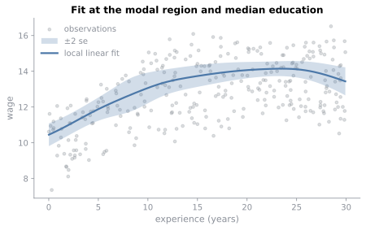
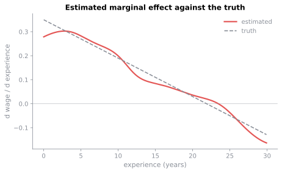

# Local polynomial regression

{func}`~kerneljax.local_poly` estimates how the conditional mean of a response changes with mixed continuous and categorical covariates without specifying a global functional form. This page starts with a local polynomial fit, works through what its selected bandwidths mean, and then uses the same fit for prediction, standard errors, and derivatives.

The setup is the shared wage example from [Working with data](data.md). That page introduced the mixed sample and the evaluation grids we will use here.

```python
import matplotlib.pyplot as plt
import numpy as np

import kerneljax as kj

rng = np.random.default_rng(0)
n = 300
exper = rng.uniform(0, 30, n)
educ = rng.integers(0, 4, n)
region = rng.integers(0, 4, n)
wage = 8 + 0.35 * exper - 0.008 * exper**2 + 1.2 * educ + rng.normal(0, 0.6, n)

data = kj.MixedData.from_blocks(
    continuous=exper,
    unordered=region,
    ordered=educ,
    unordered_levels=4,
    ordered_levels=4,
    names=("exper", "region", "educ"),
)
```

## A first fit

A local linear regression takes one line.

```python
fit = kj.local_poly(data, wage, "cv_ls", degree=1)
print(kj.summary(fit))
```

```text
Local polynomial regression

  Observations                         300
  Continuous variables                   1
  Unordered variables                    1
  Ordered variables                      1
  Estimator                   local linear
  Bandwidth type                    shared

  Variable      Kind             Bandwidth
  exper         continuous        2.792168
  region        unordered         0.750000
  educ          ordered           0.036096

  Continuous kernel         Gaussian, order 2

  Residual standard error         0.537311
  R-squared                       0.908361

  Selection                          cv_ls
  Criterion value                 0.334907
  Solver iterations                     27
  Converged                           True
```

Two choices define that fit. `degree=1` asks for a local linear regression. Rather than fitting one line to the entire sample, KernelJax fits a weighted line around every point where the regression function is evaluated.

`"cv_ls"` asks KernelJax to choose the bandwidths by least-squares cross-validation. At each candidate bandwidth, every observation is left out of its own local fit and predicted from the remaining sample. The selected bandwidth minimizes the resulting mean squared prediction error.

### What the fit is doing

To make that description concrete, write $x$ for an evaluation point and $X_i$ for training observation $i$. Its kernel weight is

$$
W_i(x) = \prod_d K_d(x_d, X_{id}),
$$

where each column contributes a kernel appropriate to its data type. Continuous kernels depend on a bandwidth $h_d$, while categorical kernels depend on smoothing parameters collected in $\lambda$.

At $x$, the local polynomial coefficients solve

$$
\hat\beta(x) = \arg\min_\beta \sum_{i=1}^{n} W_i(x) \left[Y_i-\beta^\top b_h(X_i,x)\right]^2.
$$

Only the continuous covariates enter the polynomial basis. If there are $p$ continuous columns, define the bandwidth-scaled displacement

$$
u_{id} = \frac{X_{id}-x_d}{h_d}.
$$

For a local linear fit,

$$
b_h(X_i,x) = \begin{pmatrix} 1 & u_{i1} & \cdots & u_{ip} \end{pmatrix}^{\top}.
$$

Degree zero retains only the constant term, giving the local constant or Nadaraya-Watson estimator. Degree two additionally includes every squared term and pairwise cross product, so the basis contains all monomials in $u_i$ with total degree at most two.

Categorical columns do not enter this polynomial basis. A numerical difference between two unordered labels has no meaningful slope, and ordered categories are still treated through their categorical kernel rather than as continuous coordinates. Both kinds nevertheless affect the fit through $W_i(x)$.

The bandwidth scaling in $u_{id}$ changes the units of the fitted coefficients. The intercept gives the estimated conditional mean $\hat m(x) = \hat\beta_0(x)$, while for a local linear fit the first-order coefficient satisfies

$$
\frac{\partial \hat m}{\partial x_d}(x) = \frac{\hat\beta_d(x)}{h_d}.
$$

That relationship will matter again when we ask the fitted model for derivatives later in the page.

The bandwidths themselves are selected by minimizing

$$
(\hat h, \hat\lambda) = \arg\min_{h,\lambda} \frac{1}{n} \sum_{i=1}^{n} \left[ Y_i - \hat m_{-i}(X_i) \right]^2,
$$

where $\hat m_{-i}$ is the local polynomial estimate formed without allowing observation $i$ to contribute to its own fit.

You do not need these equations to use the API, but they provide the useful mental model behind the call above. The bandwidths determine which observations count as nearby, and the local polynomial uses those weighted observations to estimate the relationship around each evaluation point.

### Reading the fit diagnostics

Before looking at the selected bandwidths themselves, the report gives several ways to assess the resulting fit.

KernelJax reports the root mean squared residual as the residual standard error,

$$
\hat\sigma_{\mathrm{RMSE}} = \left[ \frac{1}{n} \sum_{i=1}^{n} \left( Y_i - \hat m(X_i) \right)^2 \right]^{1/2}.
$$

It uses $n$ in the denominator rather than a degrees-of-freedom correction, so this is an RMSE rather than the conventional residual standard error from a parametric regression. [Kernel regression](../background/regression.md#the-smoother-matrix) develops the degrees-of-freedom correction separately.

The reported $R^2$ is also not the usual variance-decomposition statistic. KernelJax centers both the response and the fitted values at the response mean $\bar Y = n^{-1} \sum_{i=1}^{n} Y_i$ and reports their squared cosine,

$$
R^2 =
\frac{
\left[
\sum_{i=1}^{n}
(Y_i-\bar Y)
\bigl(\hat m(X_i)-\bar Y\bigr)
\right]^2
}{
\left[
\sum_{i=1}^{n}(Y_i-\bar Y)^2
\right]
\left[
\sum_{i=1}^{n}
\bigl(\hat m(X_i)-\bar Y\bigr)^2
\right]
}
$$

This is not generally the squared Pearson correlation because the fitted values are centered at $\bar Y$ rather than at their own sample mean. Whenever the denominator is nonzero, the Cauchy-Schwarz inequality keeps the statistic in $[0,1]$.

The familiar regression definition

$$
1- \frac{ \sum_i \left(Y_i-\hat m(X_i)\right)^2 }{ \sum_i (Y_i-\bar Y)^2 }
$$

agrees with it when the residuals are orthogonal to the fitted deviations $\hat m(X_i)-\bar Y$. Ordinary least squares with an intercept has that projection property. A local polynomial smoother does not generally have it.

The cross-validation criterion measures something different from either in-sample statistic. At the selected bandwidth it is

$$
\operatorname{CV}_{\mathrm{LS}} = \frac{1}{n} \sum_{i=1}^{n}
\left[Y_i - \hat m_{-i}(X_i) \right]^2,
$$

so it measures prediction of observations excluded from their own local fit. By contrast, $\hat\sigma_{\mathrm{RMSE}}^2$ uses fitted values computed with the full sample.

For a fixed linear smoother, the leave-one-out residual can be written

$$
Y_i-\hat m_{-i}(X_i) = \frac{ Y_i - \hat m(X_i) }{ 1 - H_{ii} },
$$

where $H_{ii}$ is the diagonal element of the smoother matrix. This explains why leave-one-out errors are typically larger when the observation carries appreciable weight in its own fitted value, although the ordering is not a separate guarantee of the criterion itself. [Bandwidth selection](../background/selection.md#cross-validation-for-regression) derives the identity.

Here, $0.334907$ versus $0.537311^2 \approx 0.288703$, so the leave-one-out error is larger than the in-sample mean squared residual, as we would expect in this fit.

## Reading the bandwidths

The diagnostics tell us how the fitted model behaves. The selected bandwidths tell us what kind of local structure cross-validation chose to produce that fit.

```text
Variable      Kind             Bandwidth
exper         continuous        2.792168
region        unordered         0.750000
educ          ordered           0.036096
```

For a continuous variable such as experience, the bandwidth controls the width of the local neighborhood. Larger values pool information over a wider range, while smaller values make the fit more local.

Categorical bandwidths behave differently. Near zero, observations at different levels receive little or no weight from that column. As the smoothing parameter approaches its upper bound, distinctions between levels matter less.

The region bandwidth is particularly easy to interpret. For the default Aitchison-Aitken kernel used with an unordered variable having $c$ levels,

$$
L(x, y; \lambda) =
\begin{cases}
1-\lambda, & x=y \\[4pt]
\dfrac{\lambda}{c-1}, & x\ne y
\end{cases}
$$

Its upper bound is $\bar\lambda = \frac{c-1}{c}$. At that value $1-\bar\lambda = \frac{1}{c}$, so every category receives exactly the same kernel weight. With four regions, the bound is therefore $3/4$.

```python
bound = kj.AitchisonAitken().upper_bound(4)

print(f"region  lam={fit.bandwidth.lam_uno[0]:.6f}  bound={bound:.6f}")
print(f"educ    lam={fit.bandwidth.lam_ord[0]:.6f}")
```

```text
region  lam=0.750000  bound=0.750000
educ    lam=0.036096
```

Region lands exactly on its upper bound. Its kernel factor is therefore constant across region labels, so region has effectively been smoothed out of the regression.

Education behaves very differently. Its smoothing parameter is close to zero, so observations at different education levels remain relatively distinct.

This is what the simulation was constructed to reveal. Region carries no information about the conditional mean, while education shifts it directly. KernelJax was not told either fact. The distinction emerged from choosing the bandwidths that predicted held-out observations best.

This ability to smooth across uninformative variables is particularly useful in nonparametric models, where unnecessary dimensions would otherwise increase the difficulty of estimation. [Bandwidth selection](../background/selection.md#what-cross-validation-buys) develops that idea in more detail.

## Predicting on a grid

The bandwidths tell us how the estimator is smoothing each covariate. We can now use the fitted model to inspect the relationship those bandwidths produce.

The model contains three covariates, so plotting its entire regression surface is not useful. Instead, we vary experience while holding region and education at representative values. The [Working with data](data.md#evaluation-grids) page introduced {func}`~kerneljax.grid` for constructing exactly this kind of path.

```python
points = kj.grid(data, vary="exper", n=200)
pred = kj.local_poly(data, wage, fit, at=points, se=True)
exper_grid = points.con[:, 0]

print(
    f"exper varies over {exper_grid.size} points "
    f"from {exper_grid[0]:.2f} to {exper_grid[-1]:.2f}"
)
print(f"region pinned at {points.uno[0, 0]}, educ pinned at {points.orde[0, 0]}")
```

```text
exper varies over 200 points from 0.01 to 29.92
region pinned at 2, educ pinned at 2
```

By default, `grid` holds continuous variables at their median, unordered variables at their most common level, and ordered variables at the first level whose cumulative sample share reaches the median probability. Passing `fit` back to {func}`~kerneljax.local_poly` reuses its selected bandwidths, kernels, and polynomial degree rather than running selection again.

Setting `se=True` additionally returns a pointwise plug-in standard error for the fitted mean. Before plotting that band, it is useful to be precise about what this standard error measures.

### Pointwise standard errors

The standard-error calculation uses the same unnormalized kernel weights as the fit. Write $w_i(x) = K_{h,\lambda}(x, X_i)$ and define the locally weighted response moments

$$
\bar Y_w(x) = \frac{ \sum_i w_i(x) Y_i }{ \sum_i w_i(x) } \quad \text{and} \quad \overline{Y^2}_w(x) = \frac{ \sum_i w_i(x) Y_i^2 }{ \sum_i w_i(x) }.
$$

KernelJax estimates the local variance by $\hat\sigma^2(x) = \overline{Y^2}_w(x) - \bar Y_w(x)^2$. For $p$ continuous covariates using the same continuous kernel $k$, let $R(k) = \int k(u)^2\,du$. For the default Gaussian kernel, $R(k) = \frac{1}{2\sqrt{\pi}} \approx 0.2821$. KernelJax then reports

$$
\widehat{\operatorname{se}}\left(\hat m(x)\right) = \left[ \frac{ \hat\sigma^2(x) R(k)^p }{ \sum_i w_i(x) } \right]^{1/2}.
$$

The denominator reflects the amount of local information available around $x$. With one continuous covariate and an unnormalized kernel weight, its leading behavior is proportional to $n h f(x)$, so fewer observations near an evaluation point produce a larger standard error.

There are several qualifications to keep in mind. First, the variance estimate above is formed from the locally weighted response moments associated with the constant basis term. It does not use residuals from the fitted degree-one polynomial. With `degree >= 1`, variation in the regression function within the local neighborhood can therefore enter $\hat\sigma^2(x)$ along with the noise.

Second, the returned standard error applies only to the fitted mean. It does not provide uncertainty for `grad`.

Third, a curve such as $\hat m(x)\pm 2\,\widehat{\operatorname{se}}(\hat m(x))$ is a pointwise standard-error band, not a simultaneous confidence band over the entire regression function.

Finally, the calculation does not explicitly correct smoothing bias. A local linear estimate has bias that is typically of order $h^2$ away from special cases, so the band describes sampling variation around the smoothed estimator rather than automatically producing exact coverage for the true conditional mean $m(x)$. [Kernel regression](../background/regression.md#why-local-linear-is-the-default) develops the variance approximation and the role of smoothing bias in more detail.

With those qualifications in place, we can plot the fitted mean and its pointwise standard-error band.

```python
fig, ax = plt.subplots()
ax.scatter(exper, wage, s=14, alpha=0.30, color="#8a8f98", label="observations")

ax.fill_between(
    exper_grid,
    pred.mean - 2 * pred.se,
    pred.mean + 2 * pred.se,
    alpha=0.25,
    color="#4c78a8",
    linewidth=0,
    label="±2 se",
)

ax.plot(exper_grid, pred.mean, color="#4c78a8", lw=2.2, label="local linear fit")
ax.set_xlabel("experience (years)")
ax.set_ylabel("wage")
ax.set_title("Fit at the modal region and median education")
ax.legend()
plt.show()
```



The fitted curve recovers the nonlinear relationship even though we never specified a quadratic, spline basis, or other global functional form. The standard-error band widens near the edge of the sample, where less local information is available to support the fit.

## Derivatives

The fitted mean shows the shape of the relationship with experience. A local polynomial fit can also describe how quickly that relationship is changing by returning derivatives with respect to its continuous covariates.

For a local linear fit, recall that the basis uses $u_{id} = \frac{X_{id}-x_d}{h_d}$. The coefficient $\hat\beta_d(x)$ is therefore expressed in bandwidth-scaled units, and KernelJax returns

$$
\widehat{ \frac{\partial m}{\partial x_d} }(x) = \frac{ \hat\beta_d(x) }{ h_d }.
$$

This is the same coefficient rescaling introduced when we constructed the local polynomial above. In this example, it gives an estimate of the change in expected wage associated with another year of experience at each point along the curve.

```python
slope = kj.local_poly(data, wage, fit, at=points, gradient=True)
estimated = slope.grad[:, 0]
truth = 0.35 - 2 * 0.008 * exper_grid
```

Because the data are simulated, we also know the true derivative,

$$
\frac{\partial m}{\partial e} = 0.35 - 0.016 e,
$$

so we can compare it directly with the estimate.

```python
fig, ax = plt.subplots()
ax.plot(exper_grid, estimated, color="#e45756", lw=2.2, label="estimated")
ax.plot(exper_grid, truth, ls="--", lw=1.6, color="#8a8f98", label="truth")
ax.axhline(0, lw=0.8, color="#8a8f98", alpha=0.5)
ax.set_xlabel("experience (years)")
ax.set_ylabel("d wage / d experience")
ax.set_title("Estimated marginal effect against the truth")
ax.legend()
plt.show()
```



The derivative is recovered well through most of the sample. The largest differences appear near the boundaries, where estimating a slope is harder because the local neighborhood becomes increasingly one-sided.
